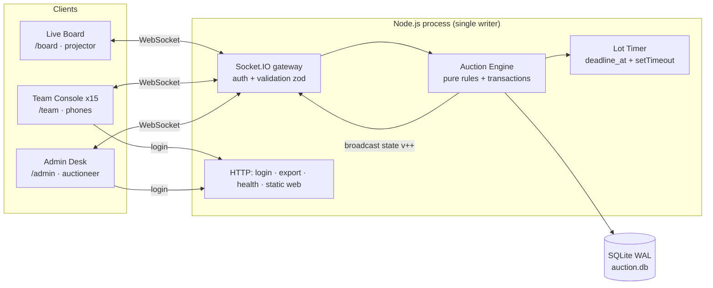

# Live IPL Mega Auction Platform — Complete Build Guide (100% Free Stack)

> **Task:** VITBMUN Tech Team — Task Round 1 (compulsory)
> **Repo name:** `Shamique_<RegNo>_IPL_Auction` (exactly `[Your Name]_[Reg.No.]_IPL_Auction`)
> **Deliverables:** working product · public Git repo · public YouTube demo (3–8 min) · viva readiness
> **Guide written:** 29 Sep 2026. Free-tier facts in §2 were checked on this date. Free tiers change often, so re-check the linked docs before you deploy.

---

## 0. TL;DR — the decisions (read this first)

| Question | Decision | Why |
|---|---|---|
| Language / runtime | **Node.js 20+ with TypeScript** | One language for server + client, first-class WebSocket ecosystem |
| Realtime | **Socket.IO** (WebSockets + auto-reconnect + acks) | Reconnect, rooms and acknowledgements come free, and you can explain each in a viva |
| Database | **SQLite via `better-sqlite3`** (WAL mode) | Zero cost, zero setup, synchronous transactions make bidding atomic and easy to reason about |
| Frontend | **React + Vite + Tailwind**, served as static files by the same Node server | One deployable, no CORS, three routes: `/board`, `/team`, `/admin` |
| Primary run mode | **Local server on a laptop, everyone on the same Wi-Fi/hotspot** | This is how the real in-hall event runs. Costs ₹0, no cold starts, no internet dependency |
| Public demo link (optional) | **Render free web service** *or* **Cloudflare quick tunnel** from your laptop | Both are free with no card (details and caveats in §2) |
| Stretch path | Cloudflare Workers + Durable Objects (free plan) | Elegant, but harder to explain in a viva. Only if you finish early |

**Core design principle (memorise this — it is your viva answer to "race conditions"):**

> The server is the single source of truth. Clients only send *intents* ("I want to bid X on lot Y"). The server validates each intent inside one SQLite transaction, in a single-threaded event loop, then broadcasts the new full state with a version number. Clients never compute money or decide winners.

---

## 1. Understand the brief → requirements checklist

### 1.1 Hard requirements extracted from the PDF

**Domain rules**

- [ ] Up to **15 franchises**, each starts with **12,500 lakhs (₹125 Cr)**
- [ ] Player-by-player lots
- [ ] Money as **integer lakhs** everywhere (no floats in storage or logic)
- [ ] Tiered increments: **+10 below 100L, +20 below 500L, else +50**
- [ ] **Server-authoritative** bidding: purse check, **leader cannot re-bid on same lot**, **Sold/Unsold atomic**
- [ ] **Lot timer with bid-reset**; UI shows clock, current bid, leading franchise, player on lot
- [ ] Squad constraints (configurable): **min 7 players, ≥1 WK, ≥3 bowlers**

**Surfaces**

- [ ] **Live Board** (projector-first): player, bid, leader, timer, purses/status ribbon
- [ ] **Team Console**: passcode login, one-tap bid, remaining purse, own squad
- [ ] **Admin / Auctioneer Desk**: start lot, control timer, Sold/Unsold, round/break, basic settings
- [ ] Optional but valued: landing page, activity log, export sold players / final squads

**Realtime**

- [ ] All clients in sync via WebSockets; **refresh must never be needed**

**Submission**

- [ ] Working product (deployed demo and/or clear local run instructions) showing Live Board + Team bid + Admin gavel
- [ ] Public Git repo: full source, meaningful commits, README (setup, stack, architecture, how to run, env vars)
- [ ] Public YouTube video 3–8 min: Live Board, bids from 2+ teams, Sold/Unsold, purse update, short architecture explanation
- [ ] README header with **Name, Registration Number, Date of Submission**
- [ ] Repo/folder named `[Your Name]_[Reg.No.]_IPL_Auction`
- [ ] Viva: data model, race conditions, auth, timer logic, failure modes

### 1.2 Evaluation criteria → what earns marks

| Criterion | What to build and show |
|---|---|
| Correctness of rules + purse/bid integrity | Pure-function rules with unit tests; DB `CHECK (purse >= 0)`; guarded `UPDATE ... WHERE purse >= ?` |
| Realtime sync under multi-client use | Full-state snapshots with a version number; reconnect resync; a 15-client load test script |
| Usability of Board / Team / Admin | Huge type on the board; one giant BID button; admin big-button "gavel" workflow with keyboard shortcuts |
| Engineering clarity | Clean structure, README with an architecture diagram, `docs/protocol.md`, meaningful commits |
| Demo + viva | Rehearsed script (§14), Q&A sheet (§15), and you have actually read every line you submit |

### 1.3 The AI policy, applied practically

AI help is allowed; **not understanding your code is not.** For every phase in §8 there is an **"Explain it aloud" checkpoint**. Do not move on until you can explain that phase to a friend with the code closed. Keep a `docs/decisions.md` file with 1–2 lines per decision and why. It doubles as viva notes.

---

## 2. The free stack — researched and verified (29 Sep 2026)

### 2.1 Hosting options, ranked for this project

| Option | Cost | Card needed? | WebSockets | Catch | Verdict |
|---|---|---|---|---|---|
| **Your laptop as server on LAN/hotspot** | ₹0 | No | Yes | Only people on the same network can join | ✅ **Primary.** Matches the real event |
| **Cloudflare Quick Tunnel** (`cloudflared tunnel --url http://localhost:3000`) | ₹0 | No account needed for TryCloudflare | Yes | Random URL each run, no uptime guarantee, your laptop must stay on | ✅ Great for the demo/viva from anywhere |
| **Render free web service** | ₹0 | No | Yes | Sleeps after 15 min idle (cold start ~30–60 s); **ephemeral filesystem** (SQLite file resets on redeploy/restart); 750 instance-hours/month | ✅ Good "deployed demo" link. Seed on boot |
| Cloudflare Workers + Durable Objects | ₹0 (Workers Free) | No | Yes (with Hibernation API) | Different programming model; free limits: 100k requests/day, 13k GB-s/day, SQLite-backed only | 🟡 Stretch path (§18) |
| Fly.io | Not free for new accounts | Yes | Yes | Only a short trial | ❌ |
| Koyeb | Free instance exists, but card required since Feb 2026 | Yes | Yes | Card hold | ❌ (not "100% free, no card") |
| Railway | 30-day trial credit, then ~$1/month credit | No | Yes | Runs out | ❌ Not reliable for a graded demo |
| Vercel / Netlify functions | ₹0 | No | **No** (serverless, no long-lived sockets) | Wrong architecture | ❌ Only for static pages |

**Notes on the research**

- **Render's official docs** state that a free web service spins down after 15 minutes without inbound traffic, and that this counts both HTTP requests and WebSocket messages from existing connections. A new WebSocket connection wakes it up. Some third-party blog posts claim WebSockets don't work on Render's free tier; Render's own docs contradict that, so trust the docs. Free instances get 750 instance-hours/month per workspace. Free web services get **no persistent disk**, so treat the SQLite file as disposable there.
- **Cloudflare quick tunnels** need no account and hand you a random `trycloudflare.com` subdomain that proxies to your localhost. Cloudflare gives **no SLA** for them, so use them for demos, not as the only plan.
- **Cloudflare Durable Objects** are available on the Workers Free plan (SQLite-backed only) with the limits above. Don't use `setTimeout` in a hibernating DO: use `alarm()`.

### 2.2 Why not Supabase/Firebase for the bidding logic?

They *can* do realtime, but the brief demands **trusted-backend bidding with atomic Sold/Unsold**. With Supabase you'd write Postgres functions plus row locks (`SELECT ... FOR UPDATE`) and put timer logic into cron/edge functions. With Firebase you'd need Cloud Functions, which now require a paid plan. A single small Node process is simpler to build, test and *explain*.

### 2.3 Tooling (all free)

| Need | Tool |
|---|---|
| Editor | VS Code |
| Git hosting | GitHub (public repo) |
| Tests | Vitest + `socket.io-client` |
| Load/race test | Your own Node script (§10) |
| Screen recording | OBS Studio (free) |
| Video edit | DaVinci Resolve or Clipchamp (free) |
| Diagrams | Mermaid (renders in GitHub README) or draw.io |
| Uptime ping (optional for Render) | UptimeRobot free tier. Only for demos; not officially supported by Render |

---

## 3. Architecture



### 3.1 Data flow for one bid (memorise)

1. Team taps **BID ₹5.2 Cr** → client emits `bid { playerId, expectedAmount, clientBidId }` with an ack callback.
2. Socket middleware already knows `socket.data.teamId` from the handshake token. **The client never sends its own team id.**
3. Handler calls `engine.placeBid(teamId, req)`, which runs **one synchronous `BEGIN IMMEDIATE` transaction**:
   dedupe → phase check → deadline check → leader check → `expectedAmount == required` → squad-full check → purse check → reserve check → insert bid → update state → reset deadline → `version++`.
4. Engine returns `{ok:true}` or `{ok:false, code}`; the ack goes back to the bidder.
5. On success the server **re-arms the timer** and **broadcasts** `state` (public) to everyone and `me` (private) to team rooms.
6. Every client replaces its state if `incoming.version > current.version`.

### 3.2 Why this is race-safe (viva gold)

- Node runs JS on **one thread**. `better-sqlite3` calls are **synchronous**, so the handler has **no `await` between read and write**. Two simultaneous bids are processed strictly one after the other.
- `BEGIN IMMEDIATE` takes SQLite's write lock up front, so even if you ever ran two processes, writes would serialise (and the second would wait or fail with `SQLITE_BUSY`, never interleave).
- `expectedAmount` gives **optimistic concurrency**: if two teams both see "next = 200" and tap at the same instant, the first wins; the second's `expectedAmount` (200) no longer equals `required` (220), so they get `STALE_BID` plus the fresh state instead of accidentally bidding 220 without seeing it.
- DB-level backstops (`CHECK (purse >= 0)`, guarded `UPDATE`) mean even a logic bug can't produce a negative purse.

---

## 4. Data model (SQLite)

```sql
-- server/src/schema.sql
PRAGMA journal_mode = WAL;
PRAGMA foreign_keys = ON;

CREATE TABLE IF NOT EXISTS teams (
  id            INTEGER PRIMARY KEY,
  code          TEXT NOT NULL UNIQUE,            -- 'CSK'
  name          TEXT NOT NULL,
  color         TEXT NOT NULL,                   -- '#f9cd05'
  passcode_hash TEXT NOT NULL,                   -- scrypt hash, never plaintext
  purse         INTEGER NOT NULL CHECK (purse >= 0)  -- lakhs
);

CREATE TABLE IF NOT EXISTS players (
  id          INTEGER PRIMARY KEY,
  name        TEXT NOT NULL,
  role        TEXT NOT NULL CHECK (role IN ('BAT','BOWL','AR','WK')),
  nationality TEXT,
  base_price  INTEGER NOT NULL CHECK (base_price > 0),   -- lakhs
  set_no      INTEGER NOT NULL DEFAULT 1,
  queue_pos   INTEGER NOT NULL,
  status      TEXT NOT NULL DEFAULT 'PENDING' CHECK (status IN ('PENDING','SOLD','UNSOLD')),
  sold_to     INTEGER REFERENCES teams(id),
  sold_price  INTEGER,
  round_sold  INTEGER,
  CHECK ((status = 'SOLD') = (sold_to IS NOT NULL))
);

CREATE TABLE IF NOT EXISTS bids (
  id            INTEGER PRIMARY KEY AUTOINCREMENT,
  player_id     INTEGER NOT NULL REFERENCES players(id),
  team_id       INTEGER NOT NULL REFERENCES teams(id),
  amount        INTEGER NOT NULL,
  round         INTEGER NOT NULL,
  ts            INTEGER NOT NULL,                -- epoch ms (server clock)
  client_bid_id TEXT NOT NULL UNIQUE             -- idempotency key
);

-- exactly one row (id = 1): the live auction state machine
CREATE TABLE IF NOT EXISTS auction_state (
  id                  INTEGER PRIMARY KEY CHECK (id = 1),
  phase               TEXT NOT NULL,             -- NOT_STARTED|ON_DECK|LIVE|PAUSED|HAMMER|IDLE|BREAK|ENDED
  round               INTEGER NOT NULL DEFAULT 1,
  current_player_id   INTEGER REFERENCES players(id),
  current_bid         INTEGER,                   -- NULL until first bid
  leader_team_id      INTEGER REFERENCES teams(id),
  deadline_at         INTEGER,                   -- epoch ms, server clock (while LIVE)
  paused_remaining_ms INTEGER,                   -- while PAUSED
  break_note          TEXT,
  last_result         TEXT,                      -- JSON {playerId,outcome,teamId,price}
  version             INTEGER NOT NULL DEFAULT 0
);

CREATE TABLE IF NOT EXISTS settings (key TEXT PRIMARY KEY, value TEXT NOT NULL);

CREATE TABLE IF NOT EXISTS events (            -- activity log / audit trail
  id INTEGER PRIMARY KEY AUTOINCREMENT,
  ts INTEGER NOT NULL, type TEXT NOT NULL, payload TEXT NOT NULL
);

CREATE TABLE IF NOT EXISTS sessions (
  token_hash TEXT PRIMARY KEY,                   -- sha256 of random 32-byte token
  role       TEXT NOT NULL CHECK (role IN ('team','admin')),
  team_id    INTEGER REFERENCES teams(id),
  created_at INTEGER NOT NULL
);
```

**Design notes**

- **Purse is deducted at SOLD, not on each bid.** Only one lot is live at a time and a team can lead only that lot, so there's no double-commitment problem. The bid check uses `purse >= required`. Show teams an "effective purse" if you like.
- `events` is append-only: bids, sold, unsold, pauses, admin overrides. It powers the activity log and is your audit story.
- Store `deadline_at` as an **absolute server timestamp**, never a countdown number. Clients derive the countdown.

### Default settings

```jsonc
{
  "startingPurse": 12500,        // lakhs
  "lotSeconds": 30,              // first timer when lot goes live
  "bidResetSeconds": 15,         // timer resets to this on every accepted bid
  "minSquad": 7, "maxSquad": 15,
  "minWK": 1, "minBowlers": 3,
  "allrounderCountsAsBowler": true,
  "enforcePurseReserve": true,   // team must keep enough to fill min squad
  "minBasePrice": 20,            // used by the reserve rule
  "autoHammer": false            // if true, expire → auto Sold/Unsold
}
```

---

## 5. Domain rules — precise specification

### 5.1 Money

- All amounts are **integers in lakhs**. 1 Cr = 100 L. Format only at the edge:

```ts
// shared/money.ts
export const nextIncrement = (current: number) =>
  current < 100 ? 10 : current < 500 ? 20 : 50;

/** First bid = base price. After that current + tiered increment (tier chosen by CURRENT bid). */
export const nextBidAmount = (currentBid: number | null, basePrice: number) =>
  currentBid === null ? basePrice : currentBid + nextIncrement(currentBid);

export const formatLakhs = (l: number) => {
  if (l < 100) return `₹${l} L`;
  const cr = l / 100;                       // display only
  return `₹${Number.isInteger(cr) ? cr : cr.toFixed(2).replace(/0$/, "")} Cr`;
};
```

**Ambiguities to state in your README (graders like explicit assumptions):**

1. *First bid equals base price*, then increments apply (e.g. base 200 → 200 → 220 → 240 …).
2. *Tier boundary uses the current bid*: at 490 → next is 510; at 500 → next is 550; at 95 → next is 105.
3. Bidding does not lower below base price; base price is the minimum opening bid.

### 5.2 Bid validity (in order; return the first failure)

| # | Check | Error code |
|---|---|---|
| 1 | Duplicate `clientBidId` → return the original success (idempotent) | *(ok, duplicate)* |
| 2 | Auction phase is `LIVE` | `LOT_NOT_LIVE` |
| 3 | `playerId` equals current lot | `STALE_LOT` |
| 4 | `now < deadline_at` (server clock; **the timestamp is the authority, not the timeout callback**) | `TIMER_EXPIRED` |
| 5 | Bidder is not the current leader | `ALREADY_LEADING` |
| 6 | `expectedAmount == nextBidAmount(...)` | `STALE_BID` (+ `required`) |
| 7 | Squad size < `maxSquad` | `SQUAD_FULL` |
| 8 | `purse >= required` | `INSUFFICIENT_PURSE` |
| 9 | If reserve rule on: `purse − required ≥ max(0, minSquad − (squadSize+1)) × minBasePrice` | `RESERVE_VIOLATION` |

The reserve rule (#9) stops a team from spending so much that it can never complete a legal squad. Make it a toggle, since some events don't use it.

### 5.3 Lot state machine

```
NOT_STARTED ──startAuction──▶ IDLE
IDLE ──nextLot──▶ ON_DECK ──startLot──▶ LIVE ⇄ PAUSED
LIVE ──timer hits 0──▶ HAMMER ──Sold/Unsold──▶ IDLE
LIVE/PAUSED ──Sold (needs a leader)──▶ IDLE      (auctioneer can gavel early)
LIVE/PAUSED ──Unsold (needs NO bids)──▶ IDLE
IDLE ──break──▶ BREAK ──endBreak──▶ IDLE
IDLE, no PENDING left ──▶ ENDED  (or newRound: UNSOLD → PENDING, round++)
```

**Why `HAMMER`?** When the clock reaches 0, bidding locks but the auctioneer confirms the outcome with one click. It avoids arguments at the last second and mirrors a real auction ("going once, twice, sold"). `autoHammer: true` skips the click.

### 5.4 Sold / Unsold (atomic)

```ts
// server/src/engine/auction.ts (essential part of markSold)
export function markSold(db: Database, now = Date.now()): Result {
  return db.transaction((): Result => {
    const st = getState(db);
    if (!["LIVE", "PAUSED", "HAMMER"].includes(st.phase)) return fail("BAD_PHASE");
    if (st.leaderTeamId == null || st.currentBid == null) return fail("NO_BIDS");

    // guarded update: also fails atomically if purse somehow < price
    const r = db.prepare(
      "UPDATE teams SET purse = purse - ? WHERE id = ? AND purse >= ?"
    ).run(st.currentBid, st.leaderTeamId, st.currentBid);
    if (r.changes !== 1) return fail("INSUFFICIENT_PURSE");

    db.prepare(
      "UPDATE players SET status='SOLD', sold_to=?, sold_price=?, round_sold=? WHERE id=?"
    ).run(st.leaderTeamId, st.currentBid, st.round, st.currentPlayerId);

    const last = { playerId: st.currentPlayerId, outcome: "SOLD",
                   teamId: st.leaderTeamId, price: st.currentBid };
    setState(db, { phase: "IDLE", currentPlayerId: null, currentBid: null,
                   leaderTeamId: null, deadlineAt: null, pausedRemainingMs: null,
                   lastResult: JSON.stringify(last) });   // also version++
    logEvent(db, "SOLD", last, now);
    return { ok: true };
  }).immediate();
}
```

`markUnsold` mirrors this: requires **no bids** (if there are bids the auctioneer should Sell, or use the admin "cancel bids" override, which is logged), sets player `UNSOLD`, returns to `IDLE`.

### 5.5 Squad rules

```ts
// server/src/domain/squad.ts
export function checkSquad(players: {role: string}[], cfg: Settings) {
  const size = players.length;
  const wk = players.filter(p => p.role === "WK").length;
  const bowlers = players.filter(p =>
    p.role === "BOWL" || (cfg.allrounderCountsAsBowler && p.role === "AR")).length;
  const missing: string[] = [];
  if (size < cfg.minSquad) missing.push(`${cfg.minSquad - size} more player(s)`);
  if (wk < cfg.minWK) missing.push("wicket-keeper");
  if (bowlers < cfg.minBowlers) missing.push(`${cfg.minBowlers - bowlers} bowler(s)`);
  return { size, wk, bowlers, ok: missing.length === 0, missing };
}
```

Show compliance on the Board ribbon (green tick / amber "needs WK") and on the Team Console.

### 5.6 Timer logic (server-authoritative, client-derived)

- **Start:** `deadline_at = now + lotSeconds*1000`.
- **On accepted bid:** `deadline_at = now + bidResetSeconds*1000` (the "bid-reset"). Document whether you reset to a fixed value or `max(remaining, reset)`. Pick one and state it.
- **Pause:** store `paused_remaining_ms = deadline_at − now`, clear timer. **Resume:** `deadline_at = now + paused_remaining_ms`.
- **Server timeout:** one `setTimeout` for `deadline_at − now`. When it fires, **re-read the DB** and only move to `HAMMER` if the phase is `LIVE` and `now >= deadline_at` (a bid may have moved the deadline). This makes stale timeouts harmless.
- **Never broadcast per-second ticks.** Send `deadlineAt` plus `serverNow`, and each client counts down locally using a clock offset (§6.3). It's cheaper, smoother and drift-free.

---

## 6. Realtime protocol

### 6.1 Roles and auth

| Role | How they connect | Permissions |
|---|---|---|
| `viewer` (Live Board, landing) | No auth | Receive `state` only |
| `team` | `POST /api/login {teamCode, passcode}` → random token; socket `auth: { token }` | `bid`, receive `state` + `me` |
| `admin` | `POST /api/admin/login {password}` (env `ADMIN_PASSWORD`) → token | All `admin:*` commands |

- Passcodes: generated at seed time (6 chars, unambiguous alphabet, no `0/O/1/I`), stored as **scrypt hashes** (`crypto.scrypt`, no native dependency), printed once to `passcodes.csv` (**gitignored**) to hand to teams.
- Tokens: `crypto.randomBytes(32)`; store only `sha256(token)` in `sessions`. The socket middleware resolves the token to `{role, teamId}` and sets `socket.data`. **Every handler reads identity from `socket.data`, never from the payload.**
- Login rate limit: e.g. 10 attempts/min per IP (`express-rate-limit`), then constant-time compare.
- Validate every payload with **zod**; reject unknown shapes.

### 6.2 Events

| Direction | Event | Payload | Notes |
|---|---|---|---|
| S→C | `state` | full `PublicState` (see below) | On connect + after every mutation |
| S→C | `me` | `{ team, squad[], compliance, effectivePurse }` | Private, to `team:<id>` room |
| S→C | `toast` | `{ kind, text }` | "Bid rejected: stale", "SOLD!" |
| C→S | `bid` | `{ playerId, expectedAmount, clientBidId }` | **ack:** `{ok, code?, required?}` |
| C→S | `time:sync` | *(ack)* `{ serverNow }` | For clock offset |
| C→S (admin) | `admin:startAuction`, `admin:nextLot {playerId?}`, `admin:startLot`, `admin:pause`, `admin:resume`, `admin:resetTimer`, `admin:sold`, `admin:unsold`, `admin:undoLast`, `admin:break {note}`, `admin:endBreak`, `admin:newRound`, `admin:settings {…}`, `admin:end` | zod-validated | All return `{ok, code?}` |

```ts
// shared/types.ts
export type Phase = "NOT_STARTED"|"ON_DECK"|"LIVE"|"PAUSED"|"HAMMER"|"IDLE"|"BREAK"|"ENDED";

export interface PublicState {
  version: number;
  serverNow: number;              // for offset calc
  phase: Phase;
  round: number;
  breakNote?: string;
  lot: null | {
    player: { id:number; name:string; role:string; nationality?:string; basePrice:number; setNo:number };
    currentBid: number | null;
    nextBid: number;              // what a bid button should show
    leaderTeamId: number | null;
    deadlineAt: number | null;    // LIVE
    remainingMs: number | null;   // PAUSED
    bidCount: number;
  };
  lastResult: null | { playerId:number; playerName:string; outcome:"SOLD"|"UNSOLD"; teamId?:number; price?:number };
  teams: { id:number; code:string; name:string; color:string; purse:number;
           squadSize:number; wk:number; bowlers:number; compliant:boolean }[];
  recent: { ts:number; type:string; text:string }[];      // last ~20 events
  queue: { remaining:number; sold:number; unsold:number };
  settings: Settings;
}
```

### 6.3 Clock sync on clients

```ts
// web/src/lib/clock.ts
let offset = 0;                                    // serverTime − clientTime

export async function syncClock(socket: Socket) {
  const samples: number[] = [];
  for (let i = 0; i < 5; i++) {
    const t0 = performance.now(), c0 = Date.now();
    const { serverNow } = await socket.emitWithAck("time:sync");
    const rtt = performance.now() - t0;
    samples.push(serverNow + rtt / 2 - (c0 + rtt));   // offset estimate
  }
  offset = samples.sort((a, b) => a - b)[2];           // median
}

export const serverTime = () => Date.now() + offset;
export const remainingMs = (deadlineAt: number) => Math.max(0, deadlineAt - serverTime());
```

Re-run `syncClock` on every reconnect and every ~30 s. Render the timer with `requestAnimationFrame` or a 100 ms interval.

### 6.4 Reconnect behaviour ("no refresh-to-catch-up")

- Socket.IO reconnects automatically. On every (re)connect the server immediately emits the latest `state` (+ `me`). Because state messages are **full snapshots** with a `version`, the client can't be "half updated". It just replaces state if `version` is newer.
- Show a visible **connection badge** (green "LIVE" / red "RECONNECTING…") on all three surfaces. Disable the BID button while disconnected.
- Team bids that time out (no ack in ~3 s) show "Not confirmed, check state". The client retries **with the same `clientBidId`**. The server's idempotency check prevents a double bid.

---

## 7. Repository structure

```
Shamique_<RegNo>_IPL_Auction/
├── README.md                    # header, quickstart, stack, architecture, env vars
├── .env.example
├── .gitignore                   # node_modules, dist, *.db, passcodes.csv, .env
├── package.json                 # npm workspaces: server, web, shared
├── shared/
│   └── src/ money.ts · types.ts · squad.ts
├── server/
│   ├── package.json · tsconfig.json
│   └── src/
│       ├── index.ts             # express + socket.io bootstrap, static hosting
│       ├── config.ts            # env parsing
│       ├── db.ts                # open DB, run schema.sql
│       ├── schema.sql
│       ├── auth.ts              # scrypt, tokens, socket middleware
│       ├── engine/
│       │   ├── auction.ts       # placeBid, startLot, pause, markSold/Unsold, ...
│       │   ├── timer.ts         # arm/clear timeout, expire handler, boot recovery
│       │   └── snapshot.ts      # buildPublicState, buildMe
│       ├── socket.ts            # event wiring + zod schemas + rate limit
│       ├── http.ts              # /api/login, /api/export.csv, /api/health
│       └── seed/ players.json · teams.json · seed.ts
├── web/
│   ├── index.html · vite.config.ts · tailwind.config.js
│   └── src/
│       ├── main.tsx · App.tsx (router)
│       ├── lib/ socket.ts · useAuction.ts · clock.ts · format.ts · sounds.ts
│       ├── pages/ Landing.tsx · Board.tsx · Team.tsx · Admin.tsx · Squads.tsx
│       └── components/ Timer.tsx · TeamRibbon.tsx · BidButton.tsx · SoldOverlay.tsx · ConnBadge.tsx
├── tests/
│   ├── rules.test.ts            # increments, squad, reserve (pure)
│   ├── engine.test.ts           # transactions against in-memory DB
│   ├── race.test.ts             # N sockets bid at once
│   └── load.ts                  # 15 bots, full lot lifecycle
└── docs/
    ├── architecture.md · protocol.md · decisions.md · viva-notes.md
    └── screenshots/
```

---

## 8. Step-by-step implementation plan

Time budget: **~9 working days** at a relaxed pace. A 5-day compressed version is in §8.10. Each phase lists **deliverable → steps → "Explain it aloud" checkpoint → commit message**.

### Phase 0 — Setup (½ day)

1. Install Node 20+ LTS, Git, VS Code. Create a **public** GitHub repo named `Shamique_<RegNo>_IPL_Auction`.
2. Scaffold:

   ```bash
   mkdir Shamique_<RegNo>_IPL_Auction && cd $_
   git init && npm init -y
   npm pkg set workspaces='["shared","server","web"]' private=true
   npm create vite@latest web -- --template react-ts
   mkdir -p shared/src server/src/{engine,seed} tests docs
   npm i -w server express socket.io better-sqlite3 zod helmet express-rate-limit dotenv
   npm i -D -w server typescript tsx vitest @types/node @types/express @types/better-sqlite3
   npm i -w web socket.io-client react-router-dom
   npm i -D -w web tailwindcss @tailwindcss/vite
   ```

3. Add `.gitignore`, `.env.example` (`PORT`, `ADMIN_PASSWORD`, `DB_PATH`, `SEED_ON_EMPTY`), an initial README header with Name / Reg. No. / Date.
4. **Commit:** `chore: scaffold monorepo (server, web, shared)`

### Phase 1 — Domain core, pure and tested (1–1½ days)

1. Write `shared/money.ts`, `squad.ts` (code in §5).
2. Write `server/src/schema.sql` (§4) and `db.ts` that opens `auction.db` (or `:memory:` in tests) and runs the schema.
3. Write seed scripts:
   - `teams.json`: up to 15 teams (`code`, `name`, `color`). Use **text names and colour swatches, not logos** (trademark hygiene).
   - `players.json`: 60–100 players is plenty. Fields: `name, role, nationality, basePrice, setNo`. Use base prices from `{20,30,50,75,100,150,200}`. Mix roles: ≥10 WK, ≥25 bowlers/ARs. Shuffle within sets for `queue_pos`.
   - `seed.ts`: insert teams with purse 12500, generate passcodes, scrypt-hash them, write `passcodes.csv`.
4. Write the engine functions (`placeBid`, `markSold`, `markUnsold`, `startLot`, …) as functions taking `(db, cfg, args, now)` so tests can inject a clock.
5. Unit tests (Vitest):
   - `nextIncrement`: 0→10, 99→10, 100→20, 499→20, 500→50
   - `nextBidAmount(null, 200) === 200`, then 220…
   - `checkSquad` combinations; reserve rule edge cases
   - Every bid-rejection code (§5.2)
   - Sold deducts exactly the price; purse never goes negative; Unsold with bids is rejected
6. **Explain it aloud:** "Walk me through what happens inside `placeBid`, in order, and why that order." · "Why integers?" · "Why is purse deducted at Sold?"
7. **Commit:** `feat(engine): bid validation, sold/unsold transactions, squad rules + tests`

### Phase 2 — Server, timer, realtime (1½ days)

1. `config.ts`: parse env with zod. `index.ts`: Express app, `helmet`, JSON body parser, Socket.IO server, static hosting of `web/dist` with SPA fallback (`/board`, `/team`, `/admin` → `index.html`).
2. `auth.ts` (§6.1): `POST /api/login`, `POST /api/admin/login`, socket middleware.
3. `timer.ts`:

   ```ts
   let handle: NodeJS.Timeout | null = null;

   export function armTimer(deadlineAt: number, onFire: () => void) {
     if (handle) clearTimeout(handle);
     handle = setTimeout(onFire, Math.max(0, deadlineAt - Date.now()));
   }
   export const clearTimer = () => { if (handle) clearTimeout(handle); handle = null; };

   // called on fire:
   export function onDeadline(db: Database, broadcast: () => void) {
     const st = getState(db);
     if (st.phase !== "LIVE" || Date.now() < (st.deadlineAt ?? 0)) return; // stale timeout → ignore
     if (cfg.autoHammer) { st.leaderTeamId ? markSold(db) : markUnsold(db); }
     else setState(db, { phase: "HAMMER" });
     broadcast();
   }
   ```

4. **Boot recovery:** in `index.ts`, if `phase === 'LIVE'` at startup (server crashed mid-lot), set `PAUSED` with `paused_remaining_ms = bidResetSeconds*1000` and let the auctioneer resume. Never silently resume a timer after a crash.
5. `snapshot.ts`: `buildPublicState()` (compute `nextBid`, team squad counts and compliance via SQL aggregates) and `buildMe(teamId)`.
6. `socket.ts`: wire events with zod + a per-socket throttle (e.g. max 5 bids/s). After every successful command: `armTimer` if needed → `io.emit('state', buildPublicState())` → emit `me` to affected team rooms.
7. Smoke-test with two `socket.io-client` scripts in the terminal.
8. **Explain it aloud:** "What if the server's `setTimeout` fires late, or a bid lands at 0.001 s?" (→ timestamp check is authoritative) · "What happens on server restart?" · "Why full snapshots instead of deltas?"
9. **Commit:** `feat(server): socket gateway, auth, lot timer with boot recovery`

### Phase 3 — Admin / Auctioneer Desk (1 day)

Build `/admin` **before** the board, since you can't test anything without it.

Layout (desktop, keyboard-friendly):

- **Top bar:** phase, round, connection badge, queue counts.
- **Left:** player queue list (search, click to put on deck, status chips).
- **Centre:** current lot card + huge timer + current bid/leader. Buttons: **Start Lot**, **Pause/Resume**, **Reset Timer**, **SOLD (S)**, **UNSOLD (U)**, **Undo last sale**.
- **Right:** round/break controls (Break with a note, End Break, New Round from Unsold), settings drawer (timers, squad limits, toggles), **Export CSV/JSON**, **Reset Auction** (type-to-confirm).
- Disable buttons that are invalid for the current phase (mirror the state machine; the server still enforces it).
- Keyboard: `Space` = start/pause, `S` = Sold, `U` = Unsold, `N` = next lot.

**Undo last sale** is a real-hall lifesaver: in one transaction, refund the purse, set the player back to `PENDING`, log an `ADMIN_OVERRIDE` event.

**Explain it aloud:** "Which admin actions are dangerous and how do you protect them?" (→ role check on socket, confirmation on reset, audit log).

**Commit:** `feat(admin): auctioneer desk with gavel, timer, rounds, settings, undo`

### Phase 4 — Team Console (1 day)

Mobile-first (portrait, ~375 px wide):

1. **Login screen:** team dropdown + passcode; store the token in `sessionStorage`; auto-login on refresh.
2. **Header:** team colour band, name, **purse (huge)**, connection badge.
3. **Lot card:** player name/role, base price, current bid, leader (with "YOU" highlighted), countdown.
4. **The BID button:** full-width, ≥72 px tall. Label `BID ₹5.2 Cr`. **Disabled with a reason** underneath: "You're leading" · "Insufficient purse" · "Not live" · "Squad full" · "Reconnecting…".
   - On tap: send `bid`, show a spinner until ack. **No optimistic update.** The truth arrives via `state`.
   - Vibrate (`navigator.vibrate(30)`) on success; shake on rejection with a toast.
5. **Squad tab:** list with role badges, price paid, and a compliance checklist ("7 players ✔ · WK ✔ · Bowlers 2/3 ✘").
6. Keep the screen awake with the Wake Lock API (`navigator.wakeLock.request('screen')`) where supported.

**Explain it aloud:** "Why is the bidder's team id never in the payload?" · "What does `STALE_BID` mean and why is it good?"

**Commit:** `feat(team): passcode login, one-tap bid, purse and squad views`

### Phase 5 — Live Board, projector-first (1 day)

Target **1920×1080 and 1280×720**, viewed from 15 m away. **No scrolling, no small text.**

```
┌──────────────────────────────────────────────────────────────────────┐
│ IPL MEGA AUCTION            ROUND 1 · SET 2           ● LIVE (conn)  │
├────────────────────────────────┬─────────────────────────────────────┤
│  [role badge]                  │            00:14                    │
│  VIRAT SHARMA                  │   (giant timer: green → amber →     │
│  Batter · India · Base ₹2 Cr   │    red pulse under 5 s)             │
│                                │                                     │
│  CURRENT BID   ₹ 5.2 Cr        │   LEADING:  ▉ MUMBAI  (team colour) │
├────────────────────────────────┴─────────────────────────────────────┤
│ Ribbon: 15 chips [CODE · purse · squad x/7 · ✔/needs WK] (2 rows max)│
├──────────────────────────────────────────────────────────────────────┤
│ Recent: MUM 5.2 Cr · CHE 5.0 Cr · MUM 4.8 Cr …            SOLD 12/80 │
└──────────────────────────────────────────────────────────────────────┘
```

Rules:

- Font sizes with `clamp()` and `vw`; current bid ≥ 12 vw; timer ≥ 14 vw.
- Dark background, high-contrast text; never rely on colour alone (always show team **name** and timer digits).
- Full-screen **SOLD!** overlay (team colour + price, ~4 s, optional gavel sound via Web Audio) and **UNSOLD** overlay. `BREAK` phase shows a large break screen with the admin's note. `ON_DECK` shows the next player with "Starting soon".
- Sound needs a user click first (browser autoplay policy). Add a "Enable sound" button in the corner of the board.
- Leading-team change animation (brief flash) so the room notices.
- Route `/squads` shows final squads (also the export view).

**Explain it aloud:** "How does the board show a timer without receiving ticks?"

**Commit:** `feat(board): projector layout with timer, ribbon, sold/unsold overlays`

### Phase 6 — Hardening and tests (1 day)

- Race test, load test, kill-server drill (§10).
- Input validation everywhere; login rate limit; disable verbose errors in production.
- Edge cases: two admins connected (last write wins but state is consistent), team logged in twice (allow; both get the same state), bid at the exact deadline, pause during HAMMER, Sold while PAUSED, undo after the next lot has started (block: only allow undoing the most recent sale when phase is `IDLE`/`ON_DECK`).
- Accessibility pass: contrast, focus states, tap-target size.
- **Commit:** `test: race, load and failure drills; fix issues found`

### Phase 7 — Export, landing, deploy, docs (½–1 day)

- `/api/export/sold.csv` (player, role, team, price, round) and `/api/export/squads.json`; buttons in the admin desk.
- Landing page at `/`: title, three big buttons (Live Board · Team Console · Auctioneer Desk), local-network URL hint.
- Deploy per §11. Write the final README (§12) and `docs/architecture.md` (paste the mermaid diagram).
- **Commit:** `docs: README, architecture, deployment; feat: exports and landing`

### Phase 8 — Demo video and viva prep (1 day)

- Rehearse §14 twice, record, upload to YouTube (public, or unlisted with the link submitted), add the link to the README.
- Do a **mock viva** with a friend using §15. Fix any answer you stumble on **by reading the code**, not by memorising.

### 8.10 Compressed 5-day plan (if time is tight)

| Day | Goal |
|---|---|
| 1 | Phase 0 + Phase 1 (engine + tests) |
| 2 | Phase 2 (server + timer + socket) + minimal Admin |
| 3 | Team Console + Live Board (core layout only) |
| 4 | Hardening (race test), deploy, exports/landing if time |
| 5 | README, video, viva prep |

**Cut order if you must (last cut first to keep):** Landing/animations/sound → Undo → Reserve rule → Export → Break/rounds. **Never cut:** atomic bid engine, leader rule, purse checks, timer with reset, three surfaces, realtime sync, README, video.

---

## 9. Client state management

```ts
// web/src/lib/useAuction.ts
export function useAuction(role: "viewer" | "team" | "admin", token?: string) {
  const [state, setState] = useState<PublicState | null>(null);
  const [me, setMe] = useState<Me | null>(null);
  const [online, setOnline] = useState(false);

  useEffect(() => {
    const socket = io({ auth: { token, role }, reconnection: true, reconnectionDelayMax: 3000 });
    socketRef.current = socket;
    socket.on("connect", () => { setOnline(true); syncClock(socket); });
    socket.on("disconnect", () => setOnline(false));
    socket.on("state", (s: PublicState) =>
      setState(prev => (!prev || s.version >= prev.version ? s : prev)));  // ignore stale
    socket.on("me", setMe);
    return () => { socket.close(); };
  }, [token, role]);

  return { state, me, online, socket: socketRef.current };
}
```

Keep **all rendering derived from `state`**. No client-side money math except formatting and computing the countdown.

---

## 10. Testing plan

### 10.1 Unit + engine tests (Vitest, in-memory SQLite)

Cover every row of the §5.2 table, sold/unsold atomicity, timer edge cases with an injected clock, undo.

### 10.2 Race test (the one graders will love)

```ts
// tests/race.test.ts
it("only one of N identical simultaneous bids wins", async () => {
  const clients = await Promise.all(teams.slice(0, 10).map(loginAndConnect));
  await admin.emitWithAck("admin:nextLot", {});
  await admin.emitWithAck("admin:startLot");
  const need = 200; // base price of the lot
  const res = await Promise.all(clients.map(c =>
    c.emitWithAck("bid", { playerId, expectedAmount: need, clientBidId: crypto.randomUUID() })));
  expect(res.filter(r => r.ok)).toHaveLength(1);
  expect(res.filter(r => !r.ok).every(r => ["STALE_BID","ALREADY_LEADING"].includes(r.code))).toBe(true);
});
```

### 10.3 Load / soak script (`tests/load.ts`)

- 15 team bots + 1 board + 1 admin bot.
- Run 20 lots: bots bid randomly with 100–800 ms jitter until the timer expires; admin bot hammers.
- **Assertions at the end:**
  - `SUM(sold_price) == startingPurse×teams − SUM(purse)` (money conservation)
  - No `purse < 0`
  - Every SOLD player has exactly one owner
  - Every client's last `state.version` equals the server's
  - Median bid→broadcast latency logged (LAN typically single-digit ms)

### 10.4 Failure drills (do these and mention them in the video/viva)

| Drill | Expected behaviour |
|---|---|
| Kill server mid-lot, restart | Lot comes back `PAUSED`; bids/purses intact (SQLite WAL) |
| Team phone toggles airplane mode | Badge turns red, reconnects, snapshot resyncs; no double bid |
| Two teams tap the same instant | One `ok`, one `STALE_BID` |
| Admin double-clicks SOLD | Second call fails with `BAD_PHASE`; purse deducted once |
| Wrong passcode ×11 | Rate limited |
| Projector browser refreshed | Board rebuilds instantly from the snapshot |

---

## 11. Deployment — three free modes

### Mode A: Local server on LAN (primary; use this for the demo recording)

```bash
cp .env.example .env         # set ADMIN_PASSWORD
npm ci
npm run seed                 # creates auction.db + passcodes.csv
npm run build                # builds web/dist
npm start                    # http://<your-LAN-IP>:3000
```

- Find the IP: `ipconfig` (Windows) / `ip addr` or `hostname -I` (Linux/Mac).
- Put everyone on **one Wi-Fi or your phone's hotspot**. Some campus Wi-Fi blocks device-to-device traffic (client isolation). If so, use the hotspot or the tunnel below.
- Windows: allow Node through the firewall on private networks.
- Print a QR code of `http://<ip>:3000/team` on the projector (`npm i qrcode` or any free generator).

### Mode B: Public URL from your laptop (free, no account)

```bash
# install cloudflared (free), then:
cloudflared tunnel --url http://localhost:3000
# → prints https://<random>.trycloudflare.com  (share this)
```

Random URL every run, no SLA. Fine for demos and remote viva sessions. Test that WebSockets connect before relying on it.

### Mode C: Render free web service (persistent public link)

1. Push to GitHub. On render.com: **New → Web Service** → connect the repo (no card).
2. Build: `npm ci && npm run build` · Start: `npm run start:seeded` (script: seed if DB is empty, then start).
3. Env vars: `ADMIN_PASSWORD`, `NODE_ENV=production`, `DB_PATH=./auction.db`, `SEED_ON_EMPTY=true`, `NODE_VERSION=20`.
4. Listen on `process.env.PORT`.
5. **Caveats to document in the README:**
   - Sleeps after 15 min without inbound HTTP/WebSocket traffic; first request may take 30–60 s. Open the URL a minute before the demo.
   - The filesystem is ephemeral: the DB is recreated from the seed on restart/redeploy. Fine for a demo; **not** for a real event (use Mode A for that).
   - Passcodes are regenerated on reseed; print them to the Render logs (or set them from env) so you can log in.
   - 750 free instance-hours/month is enough for one always-on service.

---

## 12. README template (copy into `README.md`)

```markdown
# Live IPL Mega Auction Platform

| | |
|---|---|
| **Participant** | Shamique |
| **Registration Number** | <YOUR REG NO> |
| **Date of Submission** | <DD Month YYYY> |
| **Repo** | Shamique_<RegNo>_IPL_Auction |
| **Demo video** | <YouTube link> |
| **Live demo (optional)** | <Render/tunnel link> |

## What it is
One-paragraph pitch: realtime, server-authoritative auction for an in-hall event with Live Board, Team Console and Auctioneer Desk.

## Screenshots
(board, team console, admin)

## Stack
Node.js 20 · TypeScript · Express · Socket.IO · SQLite (better-sqlite3) · React + Vite + Tailwind · Vitest

## Quick start
(commands from §11 Mode A)

## Environment variables

| Var | Default | Purpose |
|---|---|---|
| PORT | 3000 | HTTP/WebSocket port |
| ADMIN_PASSWORD | – (required) | Auctioneer login |
| DB_PATH | ./auction.db | SQLite file |
| SEED_ON_EMPTY | false | Seed teams/players if DB empty |

## Architecture
(mermaid diagram from §3 + data flow of a bid)

## Auction rules & assumptions
Increments, first-bid rule, timer reset rule, reserve rule, squad rules, Sold/Unsold rules (copy §5).

## Realtime protocol
Link to docs/protocol.md

## Security notes
Hashed passcodes, hashed session tokens, identity from socket not payload, zod validation, rate limits.

## Testing
`npm test`, `npm run test:race`, `npm run load` and what they prove.

## Known limitations / future work
Single-process by design (one writer); horizontal scaling would need a shared lock/queue or Durable Objects.

## AI assistance disclosure
Which parts AI helped with, and that all code is understood and reviewed.
```

---

## 13. Git workflow (meaningful commits)

- Branch: work on `main` with small commits, or short-lived `feat/*` branches merged via PRs. Graders read history.
- Conventional-commit style, one logical change each:

```
chore: scaffold monorepo
feat(engine): tiered increments and money formatting
test(engine): cover all bid rejection codes
feat(engine): atomic sold/unsold transactions
feat(server): socket gateway with token auth
feat(server): lot timer with boot recovery
feat(admin): auctioneer desk
feat(team): mobile bid console
feat(board): projector layout and overlays
test: race and load scripts
docs: README and architecture
```

Tag the final submission: `git tag v1.0-submission`. Don't commit `.env`, `*.db`, `passcodes.csv`.

---

## 14. YouTube demo script (target 6:30, hard limits 3–8 min)

Record with OBS: **screen 1** = Live Board (fullscreen), **screen 2** = split of Admin + two phone-sized browser windows (Team A, Team B). Add a 3rd team window for a stale-bid demo.

| Time | Scene | Say / show |
|---|---|---|
| 0:00–0:20 | Title card | Name, reg. no., project, stack in one sentence |
| 0:20–0:50 | Landing + three surfaces | "Board for the projector, console for each franchise, desk for the auctioneer" |
| 0:50–1:30 | Admin: start auction, queue a player | Show ON_DECK on the board |
| 1:30–3:00 | **Start lot; Team A and Team B bid alternately** | Point at: timer resetting on each bid, leader banner, increment tiers, recent-bid ticker. Show the "You're leading" disabled state |
| 3:00–3:30 | Rejection cases | Insufficient purse, stale bid (two teams tap at once), bid after expiry |
| 3:30–4:15 | **Sold** | Timer → HAMMER → Admin SOLD → overlay, purse updates on board + console, squad appears |
| 4:15–4:40 | **Unsold** | Lot with no bids → Unsold |
| 4:40–5:10 | Break / new round / export | Break screen, CSV export |
| 5:10–5:30 | Resilience | Refresh a phone mid-lot → instantly in sync; disconnect and reconnect |
| 5:30–6:30 | **Architecture** | Show the diagram: single writer, SQLite transaction, `expectedAmount`, snapshots with version, deadline timestamps, tests (flash the race test passing) |
| 6:30–6:45 | Wrap | Repo link, README, thanks |

Tips: 1080p, large font (Ctrl +), mic check, no dead air, disable notifications, keep the mouse calm. Add chapters (timestamps) in the YouTube description.

---

## 15. Viva prep — questions and model answers

**Data model**

1. *Why SQLite?* Single process, zero cost/ops, ACID transactions, WAL for durability and read concurrency; ideal for one auction room.
2. *Why integer lakhs?* Floats can't represent decimals exactly (0.1+0.2), and rounding errors in money are integrity bugs. Integers are exact; format only in the UI.
3. *Why is the purse stored, not derived?* Fast reads for the board; kept correct by transactional updates and a `CHECK`. Conservation is verified in tests (starting purse − remaining = Σ sold price).
4. *What is `auction_state`?* A singleton row holding the current state machine; every mutation bumps `version`.

**Race conditions**

5. *Two teams bid at the same time?* Single-threaded event loop + synchronous transaction = serial processing; `expectedAmount` makes the second one a `STALE_BID`.
6. *What if you scaled to two server processes?* Then in-memory timers and event ordering would break; `BEGIN IMMEDIATE` still serialises DB writes, but broadcasts and timers would need a shared bus. Realistic fix: one writer per auction room (Durable Object) or a Redis-based lock/pub-sub.
7. *How do you prevent double Sold?* Phase check inside the transaction + guarded `UPDATE ... WHERE purse >= ?`; the second call sees `IDLE` and returns `BAD_PHASE`.
8. *Retry after network failure, could a bid be counted twice?* No: `client_bid_id` is `UNIQUE` and checked first; a retry returns the original success.

**Auth**

9. *How are teams authenticated?* Passcode → scrypt hash compare → random 32-byte token (only its SHA-256 stored) → socket handshake sets `socket.data.teamId`.
10. *Can a team bid as another team?* No. The payload never carries a team id; identity comes from the authenticated socket.
11. *Can a team send admin commands?* Every `admin:*` handler checks `socket.data.role === 'admin'`.
12. *Board is unauthenticated: risk?* It's read-only and receives only public state; passcodes/tokens never appear in snapshots.

**Timer logic**

13. *Where does the clock live?* Server stores `deadline_at` (absolute ms). Clients count down locally with a median-of-5 offset estimate.
14. *Why not tick every second from the server?* More traffic, jitter, and it doesn't fix latency; a deadline is exact and idempotent.
15. *What if the timeout fires late or early?* The bid check uses the timestamp, and the timeout re-reads state and ignores stale fires.
16. *What resets the timer?* Each accepted bid sets `deadline_at = now + bidResetSeconds`.
17. *Server restarts mid-lot?* Boot recovery pauses the lot with a safe remaining time; the auctioneer resumes.

**Realtime**

18. *Why full snapshots?* Simple, idempotent, self-healing on reconnect; state is ~10 KB, trivial at 15 clients. Deltas add ordering bugs.
19. *How do you handle out-of-order messages?* `version` monotonic; clients ignore lower versions.
20. *Why Socket.IO over raw `ws`?* Auto-reconnect, acks (needed for the bid result), rooms (`team:<id>`), heartbeat. Cost: slightly bigger protocol.

**Failure modes**

21. *Wi-Fi drops for a team?* Badge, disabled button, auto-reconnect, resync, idempotent retry.
22. *Admin mistake (wrong Sold)?* `undoLast` restores purse and player in one transaction and logs an override.
23. *DB corruption / laptop dies?* WAL protects against crashes; copy `auction.db` periodically (or export CSV after each set). Standby laptop can load the file.
24. *What can't your system do?* Multi-room scaling, real payments, ML-style price prediction. Be honest about limits.

**Code-level: be ready to open and explain** `placeBid`, `markSold`, `armTimer/onDeadline`, `socket auth middleware`, `useAuction`, and `syncClock`.

---

## 16. Failure-mode runbook (for the real hall)

| Symptom | Fix |
|---|---|
| A team can't join | Check same Wi-Fi/hotspot; try the IP URL; use the QR code; verify passcode from `passcodes.csv` |
| Board frozen | Check the connection badge; refresh (state restores); check the server terminal |
| Wrong Sold | Admin → Undo last sale (only before the next lot starts) |
| Server crashed | Restart `npm start`; lot resumes as PAUSED; resume it |
| Timer feels off | Check the laptop clock isn't jumping (disable automatic time changes during the event) |
| Disputed last-second bid | Server timestamp decides; the activity log shows the accepted bids with times |

---

## 17. Final submission checklist

- [ ] Repo public and named `Shamique_<RegNo>_IPL_Auction`
- [ ] README header: **Name, Registration Number, Date of Submission**
- [ ] README: setup, stack, architecture, how to run, env vars, assumptions
- [ ] `.env.example` present; **no secrets**, no `passcodes.csv`, no `.db` committed
- [ ] `npm ci && npm run build && npm start` works on a clean clone (test in a fresh folder)
- [ ] Meaningful commit history; tag `v1.0-submission`
- [ ] YouTube video 3–8 min, public (or unlisted with the link submitted), link in README
- [ ] Video shows: Live Board, bids from 2+ teams, Sold, Unsold, purse update, architecture
- [ ] Tests pass (`npm test`), race test included
- [ ] You can explain every file (mock viva done)
- [ ] Deployed demo (optional) tested on a phone over mobile data

---

## 18. Stretch goals (only after everything above is solid)

1. **Cloudflare Workers + Durable Objects (free plan).** One `AuctionRoom` Durable Object *is* the engine: SQLite-backed storage (`ctx.storage.sql`), the WebSocket Hibernation API (`ctx.acceptWebSocket`) for client connections, and **`alarm()` instead of `setTimeout`** for the lot deadline, since timers prevent hibernation. Requests to a single object are serialised, so the "single writer" argument carries over. Free-plan limits: 100k requests/day, 13k GB-s/day, SQLite storage only. It gives an always-on public URL with no cold-start sleep of the Render kind, but you'd rewrite the server layer, so weigh the viva risk.
2. Auction "going once / twice / sold" caption on the board with sound.
3. Player photos (only images you have rights to; otherwise initials avatars).
4. Team-side "watchlist" and squad-gap hints ("you still need a WK").
5. Activity-log page with filters; per-team spend chart (Recharts).
6. Automatic DB backup every N minutes to a timestamped file.
7. PWA install for team consoles (offline shell, home-screen icon).
8. Playwright end-to-end test that drives Admin + two Team pages.

---

## 19. Sources used for the free-tier research (checked 29 Sep 2026)

- Render — *Deploy for Free* (spin-down rule incl. WebSocket traffic, 750 free instance-hours, port restrictions): https://render.com/docs/free
- Render changelog — *Free web services now remain active while receiving WebSocket messages*: https://render.com/changelog/free-web-services-now-remain-active-while-receiving-websocket-messages
- Render — *Platforms with a real free tier for developers in 2026*: https://render.com/articles/platforms-with-a-real-free-tier-for-developers-in-2026
- Cloudflare — Durable Objects pricing/limits (Workers Free, SQLite-backed only): https://developers.cloudflare.com/workers/platform/pricing/ and https://developers.cloudflare.com/durable-objects/
- Cloudflare — Durable Objects WebSocket Hibernation: https://developers.cloudflare.com/durable-objects/best-practices/websockets/
- Cloudflare — Quick Tunnels (TryCloudflare): https://developers.cloudflare.com/argo-tunnel/trycloudflare
- Free-hosting landscape (Fly.io no free tier for new accounts, Koyeb card requirement since Feb 2026, Railway trial credit): https://snapdeploy.dev/state-of-free-hosting and https://snapdeploy.dev/blog/free-cloud-deployment-platforms-2026-comparison

> Third-party comparison sites disagree with each other in places (one claimed Render's free tier has no WebSockets, which Render's own docs contradict). Prefer the vendor docs, and re-verify pricing on the day you deploy.

**Good luck. Build the engine first, prove it with tests, and the rest is just screens.**
