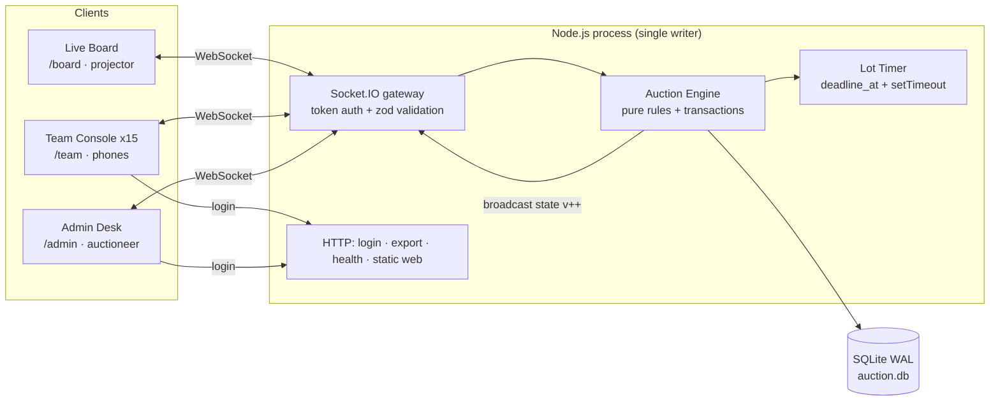

# Architecture

## The one principle

**The server is the single source of truth.** Clients send *intents* ("I want to bid X on lot Y"). The server validates each intent inside one synchronous SQLite transaction, then broadcasts the new full state with a monotonic `version`. Clients never compute money or decide winners.

## Data flow for one bid

1. Team taps **BID ₹2.2 Cr** → client emits `bid { playerId, expectedAmount, clientBidId }` with an ack callback.
2. The socket middleware resolved `socket.data.session` from the handshake token at connect time. **The client never sends its own team id.**
3. `engine.placeBid()` runs one `BEGIN IMMEDIATE` transaction:
   dedupe → phase check → deadline check → leader check → `expectedAmount == required` → squad-full → purse → reserve → insert bid → update state → reset deadline → `version++`.
4. Ack returns `{ok:true}` or `{ok:false, code, required?}` to the bidder.
5. On success the timer is re-armed, `state` (public) goes to everyone, `me` (private) to `team:<id>` rooms.
6. Clients replace their state only if `incoming.version >= current.version`.

## Why this is race-safe

- Node runs JS on **one thread**; `better-sqlite3` is **synchronous**, so a handler has no `await` between read and write. Two simultaneous bids are processed strictly one after the other.
- `BEGIN IMMEDIATE` takes SQLite's write lock up front — even with two processes, writes serialise (`SQLITE_BUSY`), never interleave.
- `expectedAmount` is **optimistic concurrency**: the loser of a same-instant race gets `STALE_BID` plus fresh state instead of silently bidding a price it never saw.
- DB backstops: `CHECK (purse >= 0)` and a guarded `UPDATE ... WHERE purse >= ?` at Sold mean even a logic bug cannot produce a negative purse.

## Timer design

- The server stores `deadline_at` — an **absolute server timestamp**, never a countdown.
- On each accepted bid the deadline resets to `now + bidResetSeconds` (fixed reset — stated assumption).
- One `setTimeout` per lot; when it fires, the engine **re-reads the DB** and only acts if the phase is still `LIVE` and `now >= deadline_at`. Stale fires are harmless no-ops.
- Clients count down locally after clock-syncing (median-of-5 offset estimate). The server never streams per-second ticks.

## Failure behaviour

- Crash mid-lot → boot recovery moves the lot to `PAUSED` with a safe remaining time; the auctioneer resumes consciously.
- Client Wi-Fi drop → auto-reconnect + fresh snapshot on connect (idempotent full state, version-guarded). No refresh needed.
- Double-click Sold → second call fails `BAD_PHASE` inside the transaction; purse deducted once.
- Lost bid ack → client retries with the **same `clientBidId`**; the UNIQUE idempotency key prevents a double bid.
